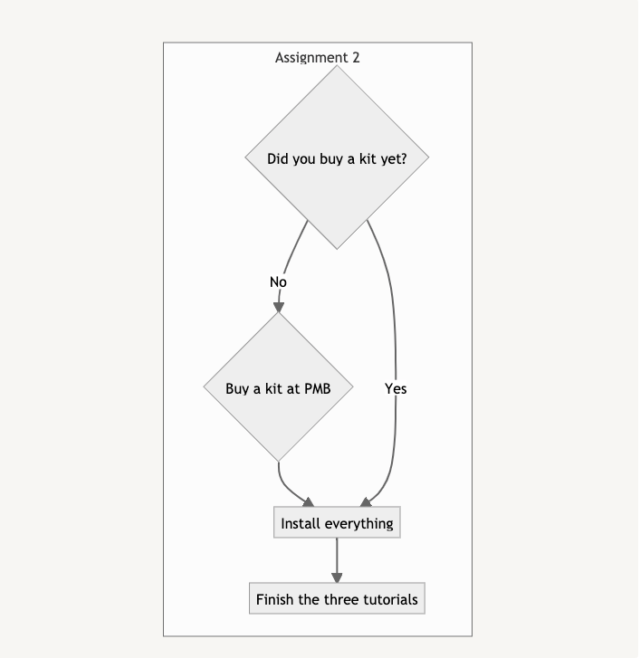

# Digital Interfaces Safari

---
## Links
[What is a computer? (Eames)](https://www.youtube.com/watch?v=eIgX6sPOqCY&t=345s){:target="_blank"}

[Switch Inspiration Machine ✨](https://switch-inspiration-machine.netlify.app){:target="_blank"}

[Additional Switch Inspiration (Lo-fi prototyping)](https://ahointeractiveproducts2018.tumblr.com/post/177335765394/brief-3-what-is-a-switch){:target="_blank"}

---
## Workshop assignment

The assignment today consists of three parts. A suggestion for timing these activities is given - your coach might have a better idea to make everything click. During the your stay in the Studio you follow directions of your coach. She will do the timekeeping and make sure you work on all three. 

Of all these activities we want to make sure you finish the final one - the prototype-test.

## Program

| Time | Activity |
| --- | --- |
| 13:45 - 14:30 | Plenair Lecture |
| 14:30 - 14:45 | Break - Find your Studio |
| 14:45 - 15:00 | Introductions coach and students |
| 15:00 - 16:30 | Start working on the part A and B |
| 16:30 - 16:45 | Prepare for the prototype-test of your switch |
| 16:45 - 17:15 | Execute the prototype-test |
| 17:15 - 17:30 | Together with your coach select the top 3 switches and close the workshop. |

## Part A: Creating switches

---

As seen in the introduction lecture, a switch can have many shapes, forms and interactive properties. In its most basic form, a switch is a device that changes directly from one state to the other. It is either `True` or `False`.

In this assignment you are going to design and build three different, hopefully very creative switches (you can find some more inspiration [here](https://ahointeractiveproducts2018.tumblr.com/post/177335765394/brief-3-what-is-a-switch)).

1. Go to our ✨ [Switch Inspiration Machine](https://switch-inspiration-machine.netlify.app) ✨ to generate a novel design brief. You don’t *need* to use it, but its constraints might help you along in your creative process and guide your design. Take a screenshot of the brief for later reference.
2. Come up with at least three different switches. Be as creative and diverse in the ideas as possible. 
3. From your list of ideas, pick your **three** favourite / most interesting designs.
4. Gather some scrap material from the Studio, build quick prototypes of the three switches. Although not having any electronic components build inside, the form should allow the design to go from one state to the other when operated by a user. 
5. Keep the designs to test later on with your peers.

## Assignment B: Starting with the kit

---

Throughout the course we will make heavy use of the Connected Interaction Kit, so it makes sense to get familiar with it right from the start.

1. If you haven’t done so yet, go and buy a your own kit at the **PMB**. There are two options (ground floor and basement) where you can buy it. Go for the one with the smallest queue.
2. Once you have your kit:
    1. Take a first look at the kit and its components
    2. Watch the soldering instructions/video of the Custom Component Tactile Switch ([Soldering Tutorial](https://id-studiolab.github.io/Connected-Interaction-Kit/tutorials/04-assemble-custom-component/tactile-switch)).
    3. Install everything necessary to start prototyping ([Tutorial 1](https://id-studiolab.github.io/Connected-Interaction-Kit/tutorials/01-hello-world/))
    4. Build your first interactive sketch ([Tutorial 2](https://id-studiolab.github.io/Connected-Interaction-Kit/tutorials/02-adding-input-and-output/))
    5. Connect your ItsyBitsy to the internet ([Tutorial 3](https://id-studiolab.github.io/Connected-Interaction-Kit/tutorials/03-connect-to-the-internet/))
3. Optional: If you have extra time at hand, explore the kit further and try out some more components. You can find detailed explanation and code examples for each component [here](https://id-studiolab.github.io/Connected-Interaction-Kit/components/).

*(If time is too short, finish this in your selfstudy time or on the next Monday afternoon).*

If you receive a soldering token, drop everything and go the the PMB Digital Lab to solder your Custom Component Tactile Switch (bring your Connected Interaction Kit). We need it for the assignment on April 28.

## Testing your design (16:30-17:15)

---

Although the functionality of your switch might be obvious to you (its designer), it might not be as obvious for others. This is why testing with users is a crucial step in the design process.

To do so:

1. Ask for an A3 Prototype-Test form, your coach has one. 
2. Prepare for the prototype-test of your switch (if you have more, choose your favourite switch). Fill out the **interaction journey** and the **outcome you expect**.
3. Split up into groups of 2 students
4. In turn, present your switch designs and test it with one another. Observe and take notes on your testers reactions.
5. Fill out the evaluation form when testing another’s design.
6. Upload the form to Brightspace: *[Week 1 - Schakelaars](https://brightspace.tudelft.nl/d2l/lms/dropbox/admin/mark/folder_submissions_users.d2l?db=95400&ou=411563)*
7. Place your switch with the others on the podium in the main hall of IO. If you want, you can print and present your chosen design brief next to it.