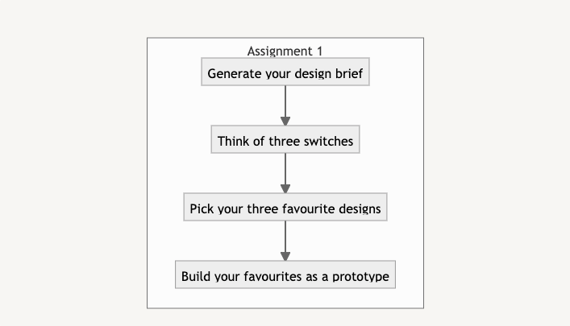

# Digital Interfaces Safari

---
## Links
[What is a computer? (Eames)](https://www.youtube.com/watch?v=eIgX6sPOqCY&t=345s){:target="_blank"}

[Switch Inspiration Machine ✨](https://switch-inspiration-machine.netlify.app){:target="_blank"}

[Additional Switch Inspiration (Lo-fi prototyping)](https://ahointeractiveproducts2018.tumblr.com/post/177335765394/brief-3-what-is-a-switch){:target="_blank"} 

---
## Workshop assignment - Creating Switches

As seen in the introduction lecture, a switch can have many shapes, forms and interactive properties. In its most basic form, a switch is a device that changes directly from one state to the other. It is either `True` or `False`.

In this assignment you are going to design and build three different, hopefully very creative switches (you can find some more inspiration [here](https://ahointeractiveproducts2018.tumblr.com/post/177335765394/brief-3-what-is-a-switch)){:target="_blank"}.

1. Go to our ✨ [Switch Inspiration Machine](https://switch-inspiration-machine.netlify.app) ✨ to generate a novel design brief. You don’t *need* to use it, but its constraints might help you along in your creative process and guide your design. Take a screenshot of the brief for later reference.
2. Come up with at least three different switches. Be as creative and diverse in the ideas as possible. 
3. From your list of ideas, pick your **three** favourite / most interesting designs.
4. Gather some scrap material from the Studio, build quick prototypes of the three switches. Although not having any electronic components build inside, the form should allow the design to go from one state to the other when operated by a user. 
5. Keep the designs to test later on with your peers.

