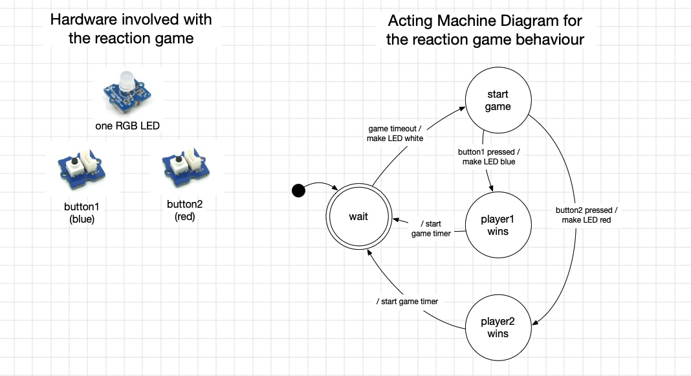

# Reaction Game
In this weeks assignment we are going to build a simple reaction game and embody it in different shapes and forms.

## Game logic and hardware involved
The basic game makes use of two input components (either Touch Sensor or Tactile Switch), and a Chainable RGB LED as an output. 

Once the LED turns white, both players have to try and touch their sensor as quick as possible. Whoever is faster wins the round, and the LED will light up in the corresponding color.


## Code for the game
We provide you with the basic code for the game. You can deduce the correct wiring of the buttons and LED from the set variables. Copy this code into your `code.py` file and connect all hardware components to have a basic game ready.

```python
##--- Imports
import digitalio
import board
import p9813
import time
import random

##--- Variables
state_wait = 0
state_start_game = 1
state_wait_button_press = 2
state_red_wins = 3
state_blue_wins = 4
current_state = 0

# Button variables
red_pin = board.D7
red_button = digitalio.DigitalInOut(red_pin)
red_button.direction = digitalio.Direction.INPUT

blue_pin = board.D13
blue_button = digitalio.DigitalInOut(blue_pin)
blue_button.direction = digitalio.Direction.INPUT

# For the Chainable LED:
pin_clk = board.D3
pin_data = board.D4
num_leds = 1
leds = p9813.P9813(pin_clk, pin_data, num_leds)

led_off = (0, 0, 0)
led_red = (255, 0, 0)
led_blue = (0, 0, 255)
led_white = (255, 255, 255)

# Timer variables
timer_duration = 0
timer_mark = 0

##--- Functions
def set_led_color(color):
    global leds
    leds.fill(color)
    leds.write()

def set_timer(duration):
    global timer_duration, timer_mark
    timer_duration = duration
    timer_mark = time.monotonic()

def timer_expired():
    global timer_mark, timer_duration
    if time.monotonic() - timer_mark > timer_duration:
        return True
    else:
        return False

##--- Main loop
while True:
    if current_state == state_wait:
        set_led_color(led_off)
        set_timer(random.randint(3, 10))
        current_state = state_start_game

    elif current_state == state_start_game:
        if timer_expired():
            set_led_color(led_white)
            current_state = state_wait_button_press

    elif current_state == state_wait_button_press:
        if red_button.value:
            current_state = state_red_wins
        elif blue_button.value:
            current_state = state_blue_wins

    elif current_state == state_blue_wins:
        set_led_color(led_blue)
        time.sleep(3)
        current_state = state_wait

    elif current_state == state_red_wins:
        set_led_color(led_red)
        time.sleep(3)
        current_state = state_wait
```