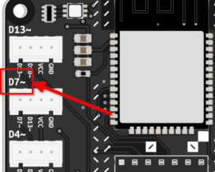

# Reaction Game
In this weeks assignment we are going to build a simple reaction game and embody it in different shapes and forms.

## Game logic and hardware involved
The basic game makes use of two input components (either Touch Sensor or Tactile Switch), and a Chainable RGB LED as an output. Refer to the component page for the [Grove Chainable RGB LED ](https://id-studiolab.github.io/Connected-Interaction-Kit/components/chainable-led/chainable-led-p9813), to obtain the P9813.py Python module.


Once the LED turns white, both players have to try and touch their sensor as quick as possible. Whoever is faster wins the round, and the LED will light up in the corresponding color.


## Connecting the cables
Your ItsyBitsy has several connection ports on it. 
To be sure that your code works properly, you need to make sure that the ports to which you connected your components are the same used in your code.

For example, if you connect a component to port D7, you need to use the following code to reference it:

|  |  |

## Code for the game
We provide you with the basic code for the game. Copy this code into your `code.py` file and connect all hardware components to have a basic game ready.
Look through the code and use the examples from the previous section to deduce where to connect your components!

```python
##--- Imports
import digitalio
import board
import p9813
import time
import random

##--- Variables
state_wait = 0
state_start_game = 1
state_wait_button_press = 2
state_red_wins = 3
state_blue_wins = 4
current_state = 0

# Button variables
red_pin = board.D7
red_button = digitalio.DigitalInOut(red_pin)
red_button.direction = digitalio.Direction.INPUT

blue_pin = board.D13
blue_button = digitalio.DigitalInOut(blue_pin)
blue_button.direction = digitalio.Direction.INPUT

# For the Chainable LED:
pin_clk = board.D3
pin_data = board.D4
num_leds = 1
leds = p9813.P9813(pin_clk, pin_data, num_leds)

led_off = (0, 0, 0)
led_red = (255, 0, 0)
led_blue = (0, 0, 255)
led_white = (255, 255, 255)

# Timer variables
timer_duration = 0
timer_mark = 0

##--- Functions
def set_led_color(color):
    global leds
    leds.fill(color)
    leds.write()

def set_timer(duration):
    global timer_duration, timer_mark
    timer_duration = duration
    timer_mark = time.monotonic()

def timer_expired():
    global timer_mark, timer_duration
    if time.monotonic() - timer_mark > timer_duration:
        return True
    else:
        return False

##--- Main loop
while True:
    if current_state == state_wait:
        set_led_color(led_off)
        set_timer(random.randint(3, 10))
    print("starting game!")
        current_state = state_start_game

    elif current_state == state_start_game:
        if timer_expired():
            print("timer expired, press your buttons!")
            set_led_color(led_white)
            current_state = state_wait_button_press

    elif current_state == state_wait_button_press:
        if red_button.value:
            print("red won")
            current_state = state_red_wins
        elif blue_button.value:
            print("blue won")
            current_state = state_blue_wins

    elif current_state == state_blue_wins:
        set_led_color(led_blue)
        time.sleep(3)
        current_state = state_wait

    elif current_state == state_red_wins:
        set_led_color(led_red)
        time.sleep(3)
        current_state = state_wait
```
