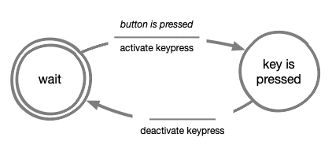
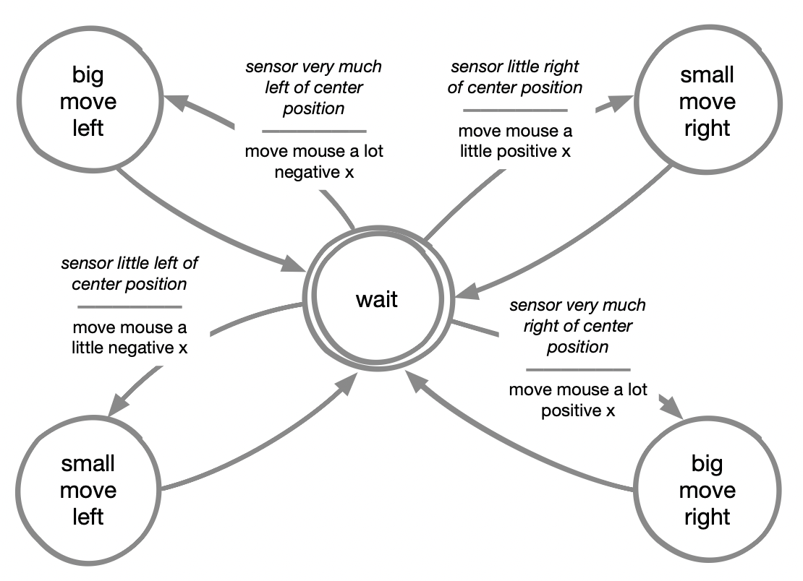

# Game Controller
In this week's assignment we are going to build and embody a physical controller to control a game on our screen.

---
## Coding Instructions
In this assignment, you’ll learn how to use the `usb_hid` library to simulate keyboard or mouse inputs with your microcontroller. Remember that when working with keyboards, it’s important to understand how keys are mapped to characters in a specific layout, and that you have the correct layout configured in your code.

Pressing a key once typically produces a single character on the screen. However, holding a key down can result in multiple repeated characters. The `usb_hid` library lets you simulate these behaviors with commands like `keyboard.press(key)` to simulate a key press and `keyboard.release_all()` to release all pressed keys.

In this assignment you’ll also explore Python basics, such as variables, loops (`while`), conditional statements (`if`, `elif`, `else`), and working with functions. 
By integrating these concepts with the `usb_hid` library, you’ll gain the skills to create interactive devices that can simulate keyboard or mouse actions dynamically.

---

## Possible games you can play
These are just some examples of games you can play, and there are many more online (or to download). Your chosen embodiment should fit the game!
1. [Flappy Bird](https://flappybird.io)
2. [Drift Boss](https://www.crazygames.com/game/drift-boss?theatreMode=true)
3. [Pong Game](https://www.ponggame.org)
4. [Crazy Flips](https://www.crazygames.com/game/crazy-flips-3d?theatreMode=true)
5. [Canabalt](https://alluracy.itch.io/canabalt-clone)

--- 

## Coding Assignment
You will see that different games need different inputs. 

Here below we present a template with **almost** everything you need to make your game controller work. Although, one crucial part is **missing**, the part inside the `while` loop.

Your assignment is to use the template code and the acting machine diagram here below to create a working controller.

**Before starting**, if it's your first time coding or has been a while since the last time, we created this page that quickly introduces you to some key coding elements: [Coding instructions](coding_instructions.md)

| Acting Machine Diagram | 
| -------------------------------------- | 
|                 | 

### Code template
```python
##--- Library Imports
import time
import board
import digitalio

# We want to emulate a keyboard interface
# To do so we use the usb_hid (Human-interface device) library to send commands to our computer
import usb_hid
from adafruit_hid.keyboard import Keyboard
from adafruit_hid.keyboard_layout_us import KeyboardLayoutUS
from adafruit_hid.keycode import Keycode

##--- Defining states
state_wait = 0
state_button_is_pressed = 1
current_state = 0

##--- Keyboard variables

# Define a new keyboard and set the layout to US (mostly same as the Dutch layout)
keyboard = Keyboard(usb_hid.devices)
keyboard_layout = KeyboardLayoutUS(keyboard)

# We want to send the SPACE key when the button is pressed
# For other keys search online "Circuit Python Keycode"
key = Keycode.SPACE

##--- Button variables

## Define a new button variable and assign it to port D13 of our board
button = digitalio.DigitalInOut(board.D13)

## Define the button as an input component
button.direction = digitalio.Direction.INPUT

##--- Main loop

# Sleep for a bit to allow the host operating system to configure the new USB device 
time.sleep(1)

while True: 

    # -------------------------------------------------------------| 
    #                                                              | 
    # Use the Acting Machine Diagram to program your solution here | 
    #                                                              | 
    # -------------------------------------------------------------|
    
    # Sleep for a bit to make the keypress events occur at a human timescale 
    # Skilled gamers can do ~7 button presses per second (says ChatGPT) 
    time.sleep(0.143)

```


If you are struggling with the assignment we provide the solution here below.
**Attention:** Keep in mind that from next week on you won't find a solution to the assignments, so you should take this opportunity to become familiar with programming concepts and try hard to make the code work.


{: .warning } 
Jumping straight to the solution might seem tempting, but it’s important to work through the assignment on your own first. By skipping ahead, you’ll miss out on learning critical concepts and skills that are essential for the next stages of the course. 

[Code solution](code_solution.md){: .btn .btn-blue }

--- 

## Extra Challenge: Control your mouse!
In this week's extra challenge you'll explore how to use the `usb_hid` library to control mouse movements and simulate clicks.

Here we propose a brief introduction on how to use the mouse functions from the `usb_hid` library:

### **Key Functions for Mouse Control**

**Mouse Clicks**
- Use `mouse.press(button)` to simulate pressing a mouse button (e.g., `Mouse.LEFT_BUTTON` for the left button or `Mouse.RIGHT_BUTTON` for the right button).
- Use `mouse.release(button)` to simulate releasing the button.
- To ensure all buttons are released, use `mouse.release_all()`.

**Moving the Mouse**
- Use `mouse.move(x=amount, y=amount)` to move the mouse pointer:
	- The `x` parameter controls horizontal movement (positive for right, negative for left).
	- The `y` parameter controls vertical movement (positive for down, negative for up).

**Scrolling**
- Use `mouse.move(wheel=amount)` to simulate scrolling the mouse wheel. Positive values scroll up, and negative values scroll down.

### **Your Challenge**

The previous section shows how to handle button inputs and control the mouse. Use it to try and implement your own logic to play different games from the ones listed.

Have fun with this challenge, and don’t hesitate to test out creative ideas! 
The more you experiment, the more you'll understand how to bring your prototypes to life.

If you're lost check the state diagram below for some inspiration on how to structure your code!

| Acting Machine Diagram | 
| -------------------------------------- | 
|                 | 