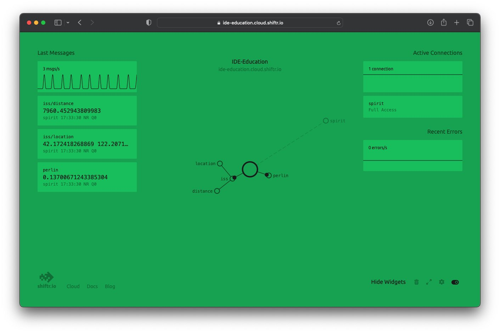

# Data Embodiment

In this weeks assignment we are going to use online data to inform our design by embodying it into a physical artefact. We will use [MQTT](https://mqtt.org) (a lightweight protocol for the Internet of Things) to provide you with multiple data sources that you can use in this assignment.

The three datasources we provide are:

1. The current coordinates of the ISS and its calculated distance to IDE in Delft
2. A [Perlin Noise](https://en.wikipedia.org/wiki/Perlin_noise) function that returns smooth values between -1 and 1

You can follow the flow of data when going to [https://ide-education.cloud.shiftr.io](https://ide-education.cloud.shiftr.io/)

---

## Before we begin

For this week’s assignment, we prepared a lot of different code snippets to help you along. They are meant for you to use and **modify** for your specific design and device. Simple copy+pasting without a rough understanding of *what* you are copying **will not work!**

Although we will use a lot of code, you are not required to understand every little line, but rather analyse your needs and search for the specific code sample.

As a prerequisite for this tutorial to work, make sure you followed and successfully completed [Tutorial 4](https://id-studiolab.github.io/Connected-Interaction-Kit/tutorials/03-connect-to-the-internet/) and connected your ItsyBitsy to the internet. 

[Get started](step-1){: .btn .btn-blue }
