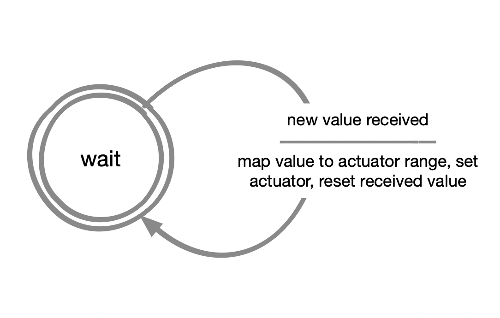

# Setting up MQTT on your ItsyBitsy

After successfully completing [Tutorial 4](https://id-studiolab.github.io/Connected-Interaction-Kit/tutorials/03-connect-to-the-internet/) and connected your ItsyBitsy to the Internet, follow the steps below to establish a basic MQTT connection with our MQTT server.

1. Extend your `settings.py` file and add the entries for the MQTT broker (the server we connect to), be sure to set your username in the parameter called **mqtt_clientid** (please construct it as **Studio[your studio]_YourName**). Save the file afterwards.
```python
settings = {
	"ssid" : "TUD-facility", # The wifi we connect to 
	"password" : "replace-with-your-iPSK-String", # Our personal password to connect to Wifi
	"mqtt_broker" : "ide-education.cloud.shiftr.io", # The MQTT server we connect to
	"mqtt_user" : "ide-education", # The username for connecting to the server
	"mqtt_password" : "Sy0L85iwSSgc1P7E", # The password for connecting to the server
	"mqtt_clientid": "Studio5_Caspar", # The device name we present to the server when connecting
}
```
2. We have prepared a library for you that sets up your microcontroller to start a wifi connection, connects to an MQTT broker and takes care of the details of receiving and publishing messages. Download this library using the button below, unzip it and add it to the `lib` folder on your microcontroller.

[Download MQTT wrapper](MQTT.zip){: .btn .btn-blue }

Open a new `code.py` file and copy the following code. 

```python
##--- Library Imports
import time
import digitalio
import board

from MQTT import Create_MQTT
from settings import settings

##--- Defining states
state_idle = 0
state_received_value = 1
current_state = 0

# Define variable to save data received from the MQTT broker
last_received_value = 0
device_has_received_new_value = False

##--- MQTT Setup

# Method used when the board receives 
# a message from the MQTT server.
def handle_message(client, topic, msg):
    global last_received_value
    global device_has_received_new_value

    # Assign message received to last_received variable
    last_received_value = msg

    device_has_received_new_value = True

# You can find the client Id in the settings.py this is used to identify the board
client_id = settings["mqtt_clientid"]

# Here you can choose what topic you want to subscribe to. The default is Perlin Noise.
# Make sure there is only one topic active at any given time (and otherwise add a # before the one you do not want to use anymore)
MQTT_topic = "perlin"
#MQTT_topic = "iss/distance"
#MQTT_topic = "iss/location"
#MQTT_topic = "coffee-waiting-line"
#MQTT_topic = "windspeed"
#MQTT_topic = "temperature"


# Create a mqtt connection based on the settings file.
mqtt_client = Create_MQTT(client_id, handle_message)

# Listen for messages on the topic specified above
mqtt_client.subscribe(MQTT_topic)


# --- Main loop
while True:
    # This try / except loop is used to continuously get new data from MQTT, and reset if anything goes wrong
    try:
        mqtt_client.loop(0.1)

    except (ValueError, RuntimeError) as e:
        print("Failed to get data, retrying\n", e)
        mqtt_client.reconnect()
        continue
    # ---------------------------------------------
    # ^ DO NOT CHANGE ANYTHING ABOVE THIS POINT ^ |
    # ---------------------------------------------

    # ----------------------------------------------------------------| 
    #                                                                 | 
    # Use the Acting Machine Diagram to program your solution here    | 
    #                                                                 | 
    # ----------------------------------------------------------------|

    # Example to print the received data - you may want to use this for your code solution
    if device_has_received_new_value == True:
        print(last_received_value)

    # ----------------------------------------------
    # v DO NOT CHANGE ANYTHING BELOW THIS POINT v  |
    # ----------------------------------------------
    device_has_received_new_value = False
    time.sleep(0.01)

```

### Acting Machine Diagram 

<div style="text-align: center;">
    
</div>

5. With the code above we connect to an MQTT client, specify the **topic** and listen to the data being sent to it.
If you want to process the data received you can use the `last_received_value` variable in the `while True` loop.

| Nog wat Text |

In the next page we show some useful functions on how to process the data received.

[Previous Step](index){: .btn .btn-gray }  [Next Step](step-2){: .btn .btn-blue }

--- 

## Extra Challenge: Use Advanced Components 

Now that you have successfully managed messages from MQTT, you can push your project further by incorporating additional components beyond the standard Connected Interaction Kit. 
This challenge encourages you to explore and integrate elements that can enhance the interactivity and visual appeal of your design.

Below are some components you can experiment with:
   - LED Strip (WS2812 / Neopixel)
   - LED Ring 
   - LED Segment Bar
   - LCD Screen
   - Speaker / MP3 Player
   - Fans

{: .note }
A basic introduction on how to use these components can be found here below:

[Complete Prototyping Components List](https://ide-studiolab.notion.site/Complete-Prototyping-Component-List-5882007ea7e94a7db77ad8bd3892cd24){: .btn .btn-blue }

Be creative and experiment! This challenge is about exploring new possibilities and applying what you've learned to enhance your project. 🚀