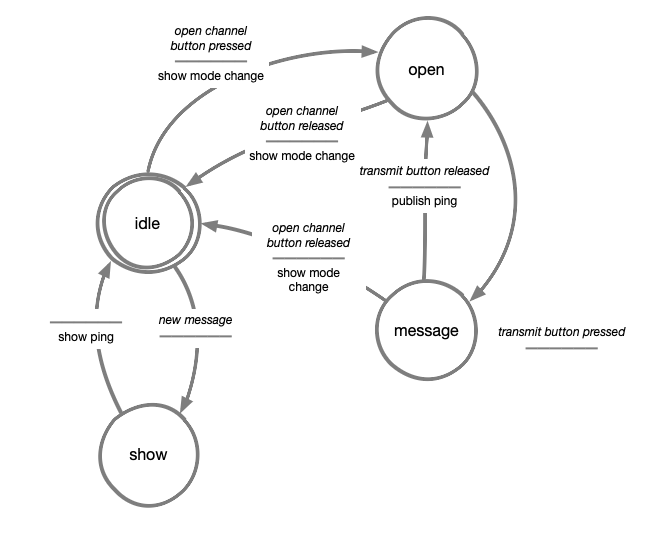
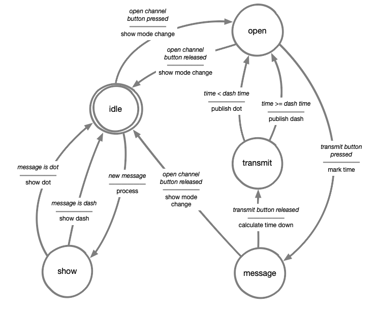

# Walkie-Talkie
In this week's assignment we are going to build-up from the knowledge learned last week on MQTT, and we will expand it by also publishing on the server!
The goal is to build a walkie-talkie that can both send and receive messages from other boards.

---

## Coding Instructions
In this assignment you will learn how to publish data to an MQTT topic and revise last week's assignment on how to process received data.

When connected to an MQTT server, we can not only listen to a topic (e.g. "perlin" and "iss/distance" from last week), but also send data to it!
Sending data to the MQTT broker is called "publishing" and when doing so, all devices which are connected to the topic you're sending information to will receive the data you send.

---

## Coding Assignment
Your goal is to implement 2 buttons and an actuator of your choice (we recommend either a piezo buzzer or a vibration motor), in the following way:
- 1 button dedicated to opening the walkie-talkie channel
- 1 button to send messages on the channel
- 1 actuator that is triggered when a message is received

**Remember that walkie-talkies cannot receive messages while their channel is open.**

Just like last week, here below we present a template with **almost** everything you need to make your walkie-talkie work. 

Although, one crucial part is **missing**, the part inside the `while` loop, you should use the acting machine diagram below the code to make your walkie-talkie work.

Happy coding!

### Code template
```python
##--- Library Imports
import time
import digitalio
import board
import neopixel

from MQTT import Create_MQTT
from settings import settings

##--- Defining states
state_idle = 0
state_receiving = 1
state_channel_open = 2
state_transmitting = 3

current_state = 0

# Define variable to save data received from the MQTT broker
last_received_value = 0

##--- Button variables
open_channel_pin = board.D13
open_channel_button = digitalio.DigitalInOut(open_channel_pin)
open_channel_button.direction = digitalio.Direction.INPUT

speak_channel_pin = board.D7
speak_button = digitalio.DigitalInOut(speak_channel_pin)
speak_button.direction = digitalio.Direction.INPUT
speak_button_released = True

def is_speak_button_pressed():
    global speak_button_released
    
    print(speak_button.value, speak_button_released)
    if speak_button.value is True and speak_button_released is True:
        speak_button_released = False
        return True
    
    if speak_button.value is False:
        speak_button_released = True 
    
    return False
        
##-- Led variables
pin_leds = board.D3
num_leds = 1
leds = neopixel.NeoPixel(pin_leds, num_leds, auto_write=False, pixel_order=neopixel.GRBW)

led_off = (0, 0, 0, 0)
led_red = (255, 0, 0, 0)
led_blue = (0, 0, 255, 0)
led_green = (0, 255, 0, 0)
led_white = (0, 0, 0, 255)

def set_led_color(color):
    global leds
    leds.fill(color)
    leds.show()

##--- Actuator variables
actuator = digitalio.DigitalInOut(board.D4)
actuator.direction = digitalio.Direction.OUTPUT

# For more information on how to use PWM check this link: 
# https://id-studiolab.github.io/Connected-Interaction-Kit/components/piezo-buzzer/piezo-buzzer.html#define-a-tone-using-pulse-width-modulation-pwm

#actuator = pwmio.PWMOut(board.D4, variable_frequency=True)

##--- MQTT configuration

# Define variable to save data received from the MQTT broker
last_received_value = 0
device_has_received_new_value = False
   
# Method used when the board receives a message from the MQTT server.
def handle_message(client, topic, msg):
    global last_received_value
    global device_has_received_new_value

    # Assign message received to last_received variable
    last_received_value = msg

    device_has_received_new_value = True


# You can find the client Id in the settings.py this is used to identify the board
client_id = settings["mqtt_clientid"]

# Create a mqtt connection based on the settings file.
mqtt_client = Create_MQTT(client_id, handle_message)


# <-------------------------------------------->
# -- DEFINE YOUR SPEAK AND LISTEN TOPIC HERE --
# VVVVVVVVVVVVVVVVVVVVVVVVVVVVVVVVVVVVVVVVVVVVVV


# Here you should select the topic of the person you want to talk to.
# Write the topic you want to send messages to.
mqtt_speak_topic = "MyListenTopic"

# You should set as "listen_topic" their "speak_topic" and vice-versa
mqtt_listen_topic = "MySpeakTopic"


# ^^^^^^^^^^^^^^^^^^^^^^^^^^^^^^^^^^^^^^^^^^^^^^
# <-------------------------------------------->


# Listen for messages on the topic specified above
mqtt_client.subscribe(mqtt_listen_topic)

##--- Main loop
while True: 
    try:
        mqtt_client.loop(0.1)

    except (ValueError, RuntimeError) as e:
        print("Failed to get data, retrying\n", e)
        mqtt_client.reconnect()
        continue
    # ---------------------------------------------
    # ^ DO NOT CHANGE ANYTHING ABOVE THIS POINT ^ |
    # ---------------------------------------------

    message = "ping"

    # Use this method to publish messages on a topic:
    # mqtt_client.publish(mqtt_speak_topic, message)

    # ----------------------------------------------------------------| 
    #                                                                 | 
    # Use the Acting Machine Diagram to program your solution here    | 
    #                                                                 |
    # Hint: Make use of the "device_has_received_new_value" variable  |
    # Hint: Use is_speak_button_pressed() to check the                |
    #       speak button is pressed.                                  | 
    # ----------------------------------------------------------------|

    # ----------------------------------------------
    # v DO NOT CHANGE ANYTHING BELOW THIS POINT v  |
    # ----------------------------------------------
    device_has_received_new_value = False
    time.sleep(0.1)
```

| Acting Machine Diagram | 
| -------------------------------------- | 
|                 | 

--- 

## Extra Challenge: Interpret received messages 

In the current assignment, your walkie-talkie sends a fixed message ("ping") each time you press the button. But real communication isn't just about sending the same thing over and over; messages can carry different meanings!  

For this challenge, modify your code so that different messages can be sent instead of always sending "ping". 
Think about the different ways in which you could send different messages, for example, assign two buttons or create a switch to select messages before sending. 

When receiving messages, be sure that your walkie-talkie also interprets incoming messages and responds differently based on their content.

Think about how this could enhance the interaction, different messages could trigger different responses from the actuator, maybe also triggering different actuators.

Push yourself to explore how MQTT can be used for more dynamic communication!

Here below we provide a more advanced acting machine digram to help you create your improved walkie-talkie

| Acting Machine Diagram | 
| -------------------------------------- | 
|                 | 