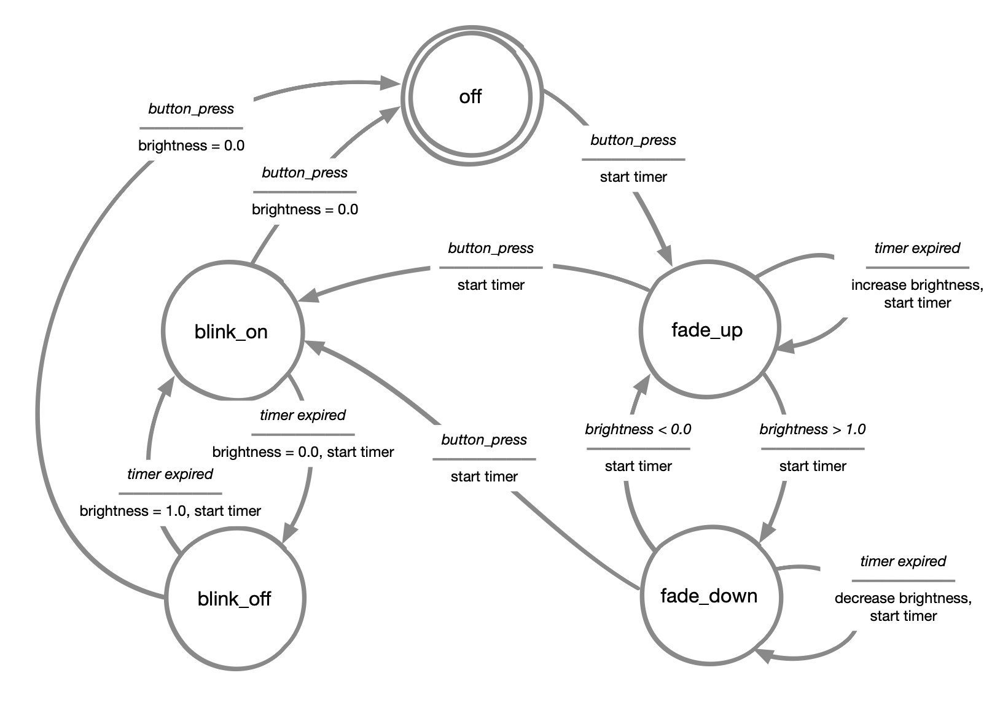

# Party Lamp

After the challenges and struggles of working with MQTT in the last two assignments, this final assignment goes back to the roots, using only 1 button and 1 LED.  
This week we will use timers to create a Party Lamp with multiple modes, focusing on writing **non-blocking code** — that is, code that can handle multiple tasks at the same time, without pausing everything else or waiting for a result.  

Introducing **blocking versus non-blocking code** (also called **multitasking**): while the product exhibits animations like transitions, fading or blinking, it always remains responsive to the user. **When you press the mode change button, the product should immediately respond by changing the light behavior.** We will test this during studio time and perhaps in the wrap-up session.  

This approach is essential when working with animations, sensors, and interactive features, and it will help us create a **responsive and dynamic Party Lamp**.

---

## Coding instructions

In the code provided below, we offer two simple timer functions that allow you to create and check timers.
These functions make it easy to work with time-based events in your code.

### Timer Functions




```c
printf("Hello, world!");
```



```go
fmt.Println("Hello, world!")
```



```python
print("Hello, world!")
```




```python
# -- Timer functions
last_timer_mark = 0
timer_duration = 0

def start_timer(duration):    # Takes duration in seconds
    global last_timer_mark, timer_duration
    last_timer_mark = time.monotonic()
    timer_duration = duration

def is_timer_expired():       # Returns True/False
    return (time.monotonic() - last_timer_mark) > timer_duration
```

### Timer examples
```python
import time

start_timer(2.0)             # Creates and starts a timer of 2 seconds 
print(is_timer_expired())    # Will print "False", since 2 seconds haven't passed

time.sleep(3)                # Wait 3 seconds
print(is_timer_expired())    # Will print "True", since more than 2 seconds have passed
```

Once a timer has expired, you can always create a new timer with `start_timer()` — this will start a fresh timer with the duration you specify.

---

## Coding Assignment

Just like in previous weeks, we only provide a template with the components already configured and a couple of helper functions.  

Your goal is to use the **Acting Machine Diagram** below the code template to complete the part inside the `while True:` loop and implement a **Party Lamp**.

The lamp should cycle between the following modes:
- **Off**: The LED is off.  
- **Fade**: The LED slowly fades off, then fades on again continuously.  
- **Blink**: The LED rapidly blinks on and off.  

For this assignment, we will use a **Button** and a **neopixel LED**.  
Be sure to check the template code to see where they should be connected.

### Code template

```python
##--- Main Loop
import board
import neopixel
import digitalio
import time

# -- Define states
state_off = 0
state_fade_in = 1
state_fade_out = 2
state_blink_on = 3
state_blink_off = 4

current_state = state_off

# -- Initialize the button
button = digitalio.DigitalInOut(board.D7)
button.direction = digitalio.Direction.INPUT

button_released = True

# -- Button debounce function
def is_button_pressed():
    global button_released
    
    if button.value is True and button_released is True:
        button_released = False
        return True
    
    if button.value is False:
        button_released = True
    
    return False

# -- Initialize the NeoPixel
led = neopixel.NeoPixel(board.D13, 1, brightness=0.3, auto_write=False, pixel_order=neopixel.GRBW)

# Define basic led colors
led_off = (0, 0, 0, 0)
led_red = (255, 0, 0, 0)
led_green = (0, 255, 0, 0)
led_blue = (0, 0, 255, 0)
led_white = (0, 0, 0, 255)

def set_led_color(color):
    global led
    led.fill(color)
    led.show()


# -- Timer functions
last_timer_mark = 0
timer_duration = 0

def start_timer(duration):
    global last_timer_mark, timer_duration
    last_timer_mark = time.monotonic()
    timer_duration = duration

def is_timer_expired():
    return (time.monotonic() - last_timer_mark) > timer_duration

# Initialize timer durations
fade_duration = 0.01  # Controls fade speed
blink_duration = 0.2  # Controls blink speed

# Controls fade in/out steps: 
# - low numbers: smooth transition, but slow.
# - high numbers: fast transition, but rough.
fade_step = 0.05    


while True:


    # ----------------------------------------------------------------| 
    #                                                                 | 
    # Use the Acting Machine Diagram to program your solution here    | 
    #                                                                 | 
    # Hint: you can use led.brightness to acces and change the        | 
    #       ligth brightness.                                         | 
    #       The brightness has a value between 0.0 and 1.0.           | 
    #                                                                 | 
    # ex: led.brightness = 0.5  # Sets the led to half the brightness | 
    #                                                                 | 
    # ----------------------------------------------------------------|


    # ----------------------------------------------
    # v DO NOT CHANGE ANYTHING BELOW THIS POINT v  |
    # ----------------------------------------------
    led.show()
    time.sleep(0.1)
```

| Acting Machine Diagram | 
| -------------------------------------- | 
|                 | 

---

## Extra challenge 

**Add new modes to the Party Lamp!**  
If you manage to get the basic modes working, try extending your Party Lamp by adding more complex effects, such as:  
- **Rainbow mode**: Slowly shifting between all colors of the rainbow.  
- **Strobe mode**: Very fast flashing (disco-style).  
- **Special color programs**: Sequences of color changes, like alternating between red and green for a Christmas effect.  

You'll need to think carefully about how to manage the timing and transitions using your timers, while keeping everything responsive to the button press.
