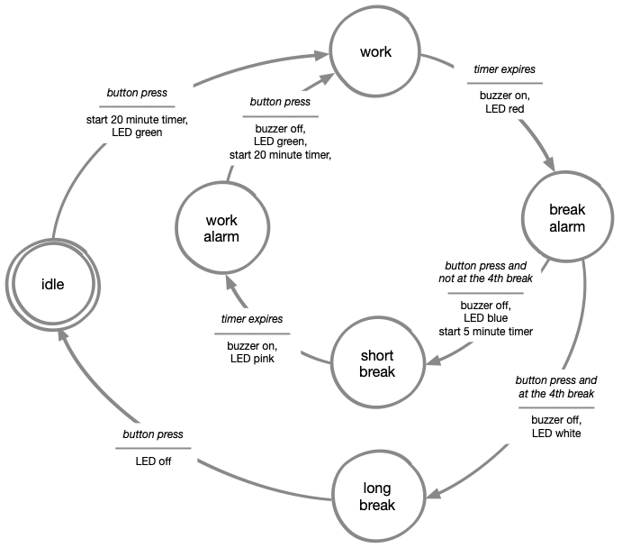

# Step 1: Preparation
To follow this tutorial, you will need your ItsyBitsy, a chainable LED, a button, a buzzer, and a servo motor. You will also need materials to construct the Pomodoro Timer embodiment. These materials can be picked up at the faculty.

The Pomodoro technique can be described by the following steps:

1.  Set the pomodoro timer.
2.  Work on the task.
3.  When the timer rings, stop working on the task.
4.  Take a small break. If you've had three small breaks, take a longer break instead.
5.  Repeat until task is done.

These steps will look like this in a state diagram:


Open Mu and create a new file. Add the following template to the file:

```python
##--- Imports

##--- Variables

##--- Functions
##--- Acting Machine cause functions

##--- Acting machine effect functions

##--- Main loop
while True:
	return

```
This template provides us with some basic organization for the programming that we will do in the following steps. Save this new file as *code.py* on your ItsyBitsy. If you already have a *code.py* file from a previous tutorial, move it over to some place on your computer so you can access it later.

[Next Step](step2){: .btn .btn-blue }